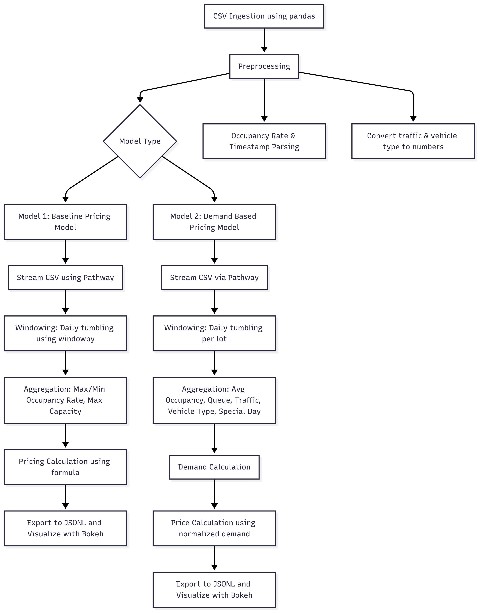

# 🚗 Dynamic Parking Pricing System (Real-time with Pathway & Bokeh)
This project implements a real-time dynamic parking pricing model that adjusts parking fees based on factors like demand, traffic, queue length, special events, and vehicle type. The goal is to optimize resource usage, reduce congestion, and improve user experience by simulating real-world parking dynamics using streaming data.
## 📌 Key Features

- ⏱️ **Real-time processing** using [Pathway](https://github.com/pathwaycom/pathway)
- 📊 **Interactive price visualizations** using Bokeh + Panel
- 🧠 **Two intelligent pricing models**: Baseline and Demand-Based
- 📈 Prices stay fair: always between **0.5x and 2x** of the base price

## 📂 Dataset Overview

The project uses a **simulated real-time dataset** that mimics the behavior of multiple city parking lots across different conditions.

### 🔸 Source File
- **File Name**: `dataset.csv`
- **Format**: CSV (Comma-Separated Values)
- **Rows**: 18,368
- **Parking Lots**: 14 unique locations (identified via `SystemCodeNumber`)

### 🔸 Schema

| Column Name           | Description                                              | Type     |
|-----------------------|----------------------------------------------------------|----------|
| `SystemCodeNumber`    | Unique ID for each parking lot                           | string   |
| `Latitude`            | Geographic latitude of the parking lot location           | float   |
| `Longitude`           | Geographic longitude of the parking lot location          | float    |
| `LastUpdatedDate`     | The date when the occupancy data was last updated        |  string  |
| `LastUpdatedDate`     | The exact time on the update date when the data was recorded. |  string  |
| `Occupancy`           | Current number of parked vehicles                        | int      |
| `Capacity`            | Total capacity of the parking lot                        | int      |
| `QueueLength`         | Number of vehicles waiting to park                       | int      |
| `TrafficConditionNearby` | Nearby traffic status: Low, Average or High      | string   |
| `IsSpecialDay`        | Indicates special events (e.g. holidays, festivals)      | boolean  |
| `VehicleType`         | Type of vehicle: Bike, Car, Truck , Cycle                 | string   |

### 🔸 Engineered Features

These are derived during stream ingestion using `Pathway` and UDFs:

| Feature         | Description                                             |
|-----------------|---------------------------------------------------------|
| `OccupancyRate` | Ratio of `Occupancy / Capacity`                        |
| `TrafficLevel`  | Encoded traffic severity: Low → 0, Average → 1, High → 2 |
| `VehicleFactor` | Encoded vehicle type: Cycle → 0, Bike → 1, Car → 2, Truck → 3|
| `day_id`        | Unique ID per lot per day for time windowing           |
| `instance`      | Time-based grouping for real-time windowing            |
| `Timestamp`     | Event timestamp (format: `%Y-%m-%d %H:%M:%S`)   

## 🛠️ Tech Stack

| Component         | Tool / Library           | Role                            |
|------------------|--------------------------|---------------------------------|
| Real-time Engine | Pathway                  | Stream processing & time windows |
| Visualization    | Bokeh + Panel            | HTML plots for pricing trends  |
| Data Handling    | Pandas, NumPy            | Intermediate analytics          |
| Storage          | CSV, JSONL               | Input stream and output data    |
| Notebook         | Google Colab             | Dev & demo environment          |

## 🧠 Model 1: Real-Time Baseline Pricing Model

This model calculates a **dynamic base price** for each parking lot in real-time based on daily occupancy fluctuations. It uses **Pathway's stream processing** to aggregate data in **daily tumbling windows**.

### ⚙️ Key Idea

A parking lot’s demand volatility is captured using the difference between **maximum** and **minimum occupancy rate** within a day. Higher volatility suggests higher demand, which justifies price adjustments.

### 📈 Pricing Formula
<pre> price = base_price + (occ_max - occ_min) / capacity </pre>

### 🧱 Architecture Flow

1. **Initial Ingestion**: Load CSV data using `Pandas`
2. **Preprocessing**: Feature engineering including `OccupancyRate` and timestamp parsing
3. **Streaming Pipeline**: Stream preprocessed data via `Pathway`
4. **Windowing**: Daily tumbling window using `windowby()`
5. **Aggregation**:
   - Max/Min Occupancy Rate
   - Max Capacity
6. **Pricing Calculation**: Using the formula above
7. **Export/Plotting**: Saved to JSONL and visualized using Bokeh

## 📈 Results & Inference
- **Goal**: Adjust the parking price based on daily variations in occupancy.
- **Observation**: The plotted price fluctuates across days for each lot, depending on the difference between maximum and minimum occupancy rates.
- **Inference**: Lots with high variation in occupancy see greater pricing adjustments, reflecting dynamic demand. This model ensures basic responsiveness without overcomplicating the logic.

## ⚡ Model 2: Demand-Based Dynamic Pricing

This model adjusts parking prices based on **real-world demand factors** that affect parking pressure in urban areas. It provides a more responsive pricing scheme than the baseline.

### 🔍 Demand Formula

We define a composite demand function:

<pre> Demand = α · (Occupancy / Capacity) + β · QueueLength − γ · TrafficLevel + δ · IsSpecialDay + ε · VehicleTypeWeight </pre>

Where:

- `α` (alpha) = 5.0 → Emphasizes occupancy
- `β` (beta) = 0.4 → Importance of queue buildup
- `γ` (gamma) = 1.5 → Penalizes heavy traffic
- `δ` (delta) = 2.0 → Boosts price on special days
- `ε` (epsilon) = 1.0 → Based on type of vehicle (e.g., Truck > Car > Bike > Cycle)

### 💰 Price Formula
price = base_price × (1 + λ × NormalizedDemand)

- `base_price` = 10 (minimum baseline)
- `λ` (lambda) = 0.2 (scaling factor)
- `NormalizedDemand` = demand / max_demand, clipped to [0.0, 1.0]
- Price is clipped to remain within [0.5 × base, 2.0 × base]

### 🎯 Intuition

- Encourages **higher prices when demand is high** (e.g., long queues, special events)
- Offers **lower prices when conditions are relaxed**
- Ensures prices stay within a safe, **bounded range**

### 🔄 Architecture Flow

1. **Inittial Ingestion**: Load CSV data using `Pandas`.
2. **Preprocessing**:
   - Convert traffic and vehicle type to numerical levels.
   - Compute `OccupancyRate` and timestamp parsing.
3. **Streaming pipeline**: Stream preprocessed data via `Pathway`.
4. **Windowing**: Daily tumbling windows per lot
5. **Aggregation**:
   - Average Occupancy, Queue Length, Traffic, Vehicle Type
   - Special day indicator
6. **Demand Calculation**: Using the weighted formula
7. **Price Calculation**: Based on normalized demand
8. **Export & Plot**:
   - JSONL file written using Pathway
   - Visualized using Bokeh (per-lot pricing trends)

## 📈 Results & Inference
- **Goal**: Determine a more intelligent price based on a combination of factors — occupancy, queue length, traffic condition, vehicle type, and special day status.
- **Observation**: The plotted prices show more refined variation, often differing from Model 1, as they react to multi-factor demand changes.
- **Inference**: This model provides nuanced and fair pricing by factoring in local demand stressors. For example, high traffic and long queues during a festival day lead to higher prices.

---
### 🏗️ Architecture Diagram

---
### 🚀 Future Improvements

While the project currently implements two core dynamic pricing models — a **Real-Time Baseline Model** and a **Demand-Based Pricing Model** — a potential enhancement includes integrating a **Competitive Pricing Model**. This model would dynamically adjust parking rates based on nearby competitors’ pricing using geographic proximity (latitude and longitude). Additionally, future work could explore deeper integration of real-world traffic APIs, predictive occupancy trends, and user behavior analytics to further optimize pricing strategies and rerouting decisions.
